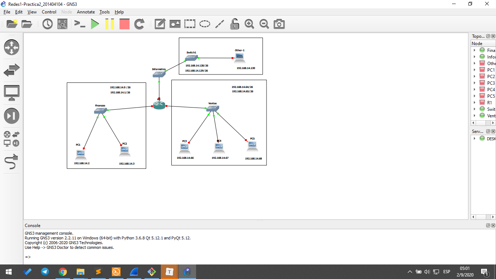
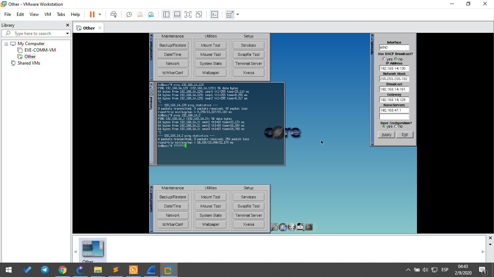
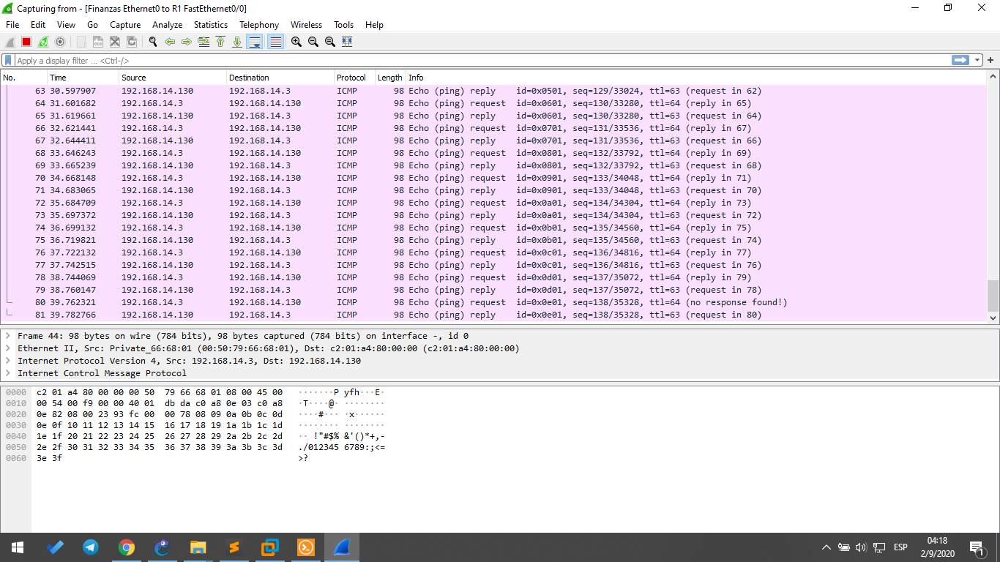

Andrea Nicte Vicente Campos

201404104

# Configuración

Para la siguiente topología se utilizaron:

- 1 router
- 3 switch
- 5 vpc
- 1 maquina virtualizada

## Topología

## Configuración del router

Para esta practica se utilizo un router con 3 interfaz, a continuacion se muestran las configuraciones para cada interfaz 

|           Interface            |
| :----------------------------: |
|  fastEthernet 0/0 (Finanzas)   |
|   fastEthernet 0/1 (Ventas)    |
| fastEthernet 1/0 (Informatica) |

### Configuración fastEthernet 0/0 

> $configure terminal

> $interface fastEthernet 0/0

> $ip address 192.168.14.1 255.255.255.192

> $no noshutdown

> $exit

### Configuración fastEthernet 0/1

> $configure terminal

> $interface fastEthernet 0/1

> $ip address 192.168.14.65 255.255.255.192

> $no noshutdown

> $exit

### Configuración fastEthernet 1/0

> $configure terminal

> $interface fastEthernet 1/0

> $ip address 192.168.14.129 255.255.255.192

> $no noshutdown

> $exit

### Guardar la configuración del router

> $write memory

## Configuración pc's

### PC1

> $ip 192.168.14.2 255.255.255.192 192.168.14.1
>
> $save

### PC2

> $ip 192.168.14.3 255.255.255.192 192.168.14.1
> $save

### PC3

> $ip 192.168.14.66 255.255.255.192 192.168.14.65
> $save

### PC4

> $ip 192.168.14.67 255.255.255.192 192.168.14.65
> $save

### PC5

> $ip 192.168.14.68 255.255.255.192 192.168.14.65
>
> $save

### Other (linux-tiny)

# Reportes

### Cálculos de dominio de broadcast y dominios de colisión

|             | Dominios brodcast | Dominios colisión |
| ----------- | ----------------- | ----------------- |
| Finanzas    | 1                 | 3                 |
| Ventas      | 1                 | 2                 |
| Informática | 1                 | 1                 |

### Captura de paquetes

